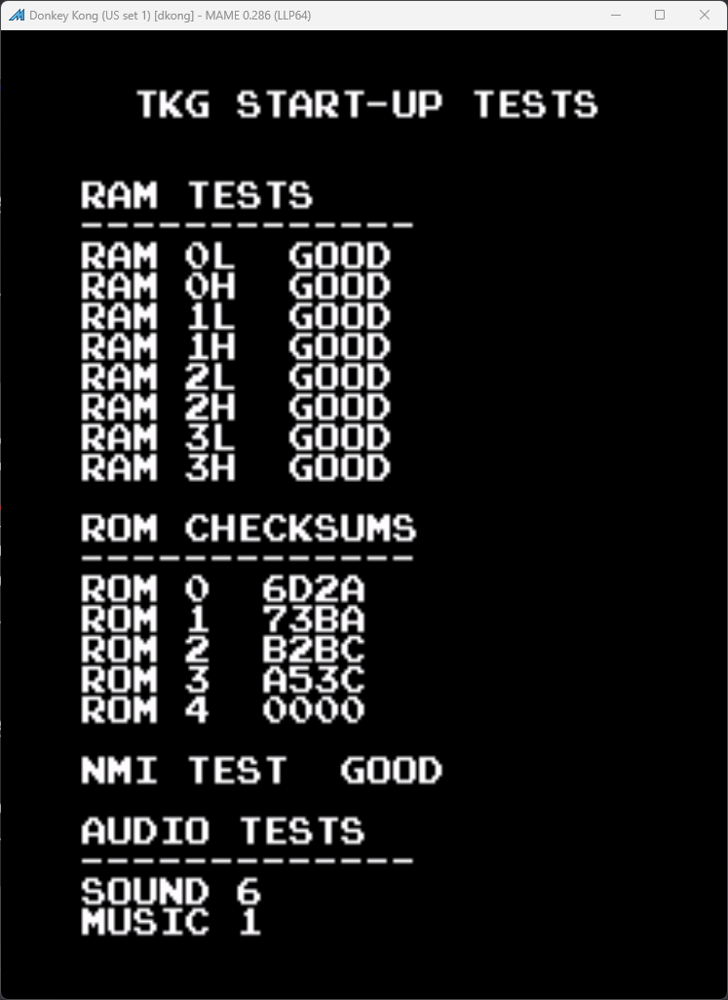
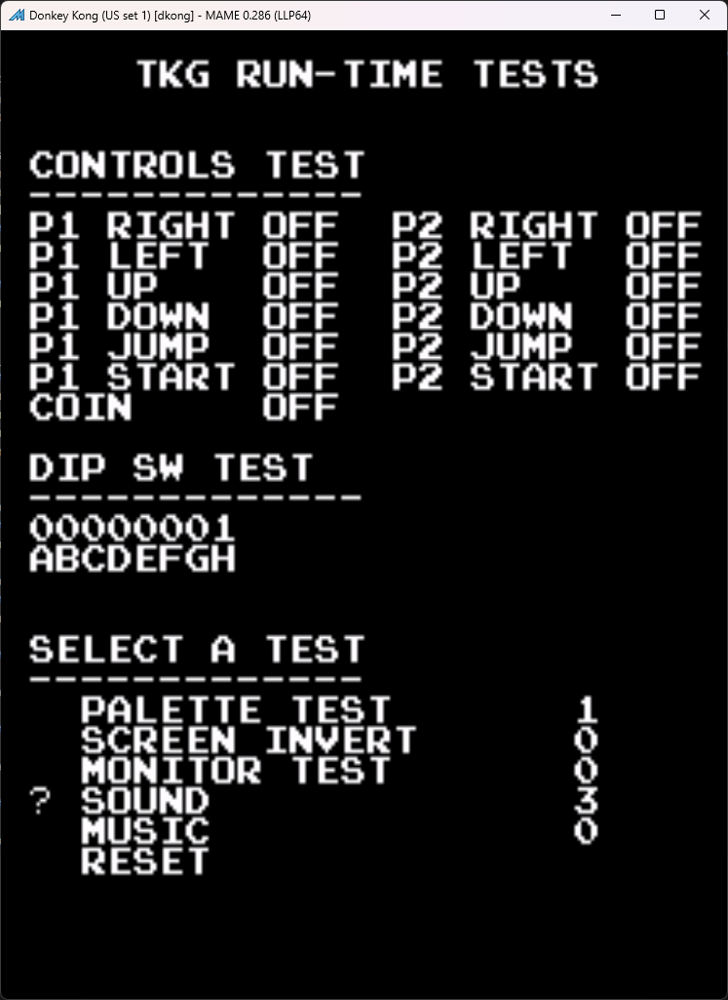

# TKG-Test-ROM
Test ROM suite for TRS, TKG, and DJR hardware

This is a work in progress and is nowhere near completion.

## Currently Supported Tests
- ROM Checksum printing
- Dk specific sound/music test
- Switch input test
- NMI test
- RAM check (1/3 tests implemented)
    - sprite and video ram
    - check for RAM corruption
    - print failed RAM ID

## Planned Tests
- RAM check
    - sprite and video ram
    - check for correct RAM chip writting
    - check for RAM corruption
    - print failed RAM ID

- coin counter test
- DIP switch test
- Screen invert test
- grid tests (Radar Scope)
- radarscope specific sound tests
- dk jr specific sound tests
- color pallet tests
- one or two monitor adjustment tests

## Miscellaneous To-Do's
- write manual

## Images

