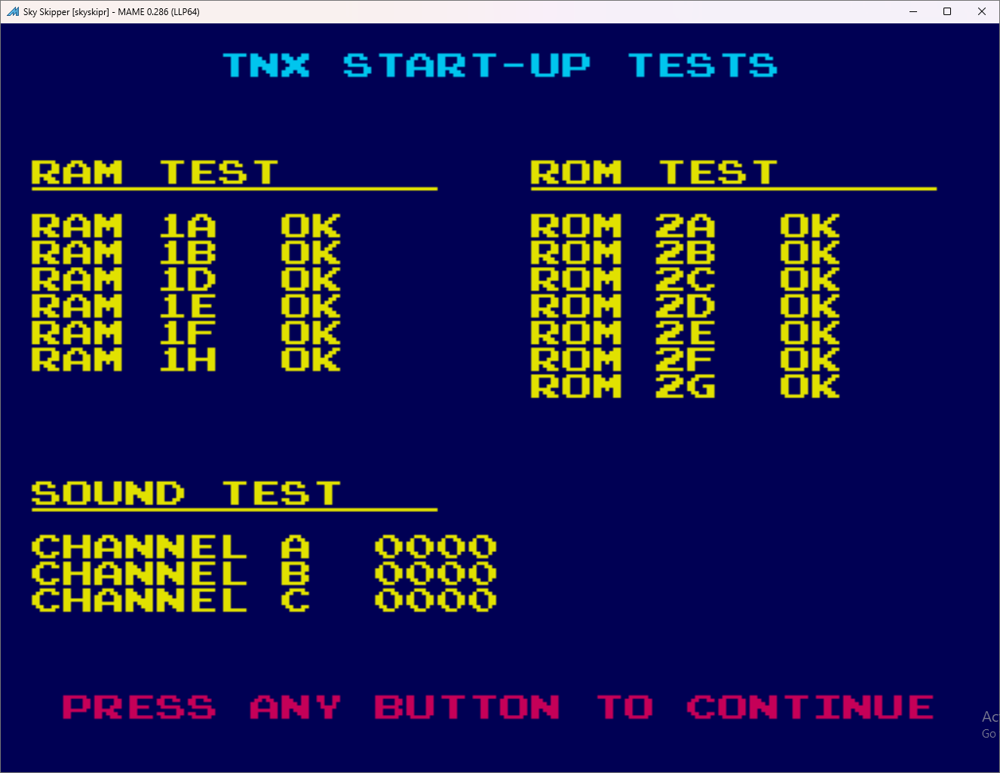

# Sky Skipper Test ROM
This ROM contains test code to run on original TNX PCBs. It was designed with Sky Skipper in mind and may not work with a popeye modified TNX PCB.

## Using the Test ROM
Burn the test ROM (found in release folder) to a 2732 EPROM. Place the EPROM at location 2A on the CPU board.

All tested chips appear on screen as their appropriate locations on the CPU board. Right now it only tests RAM, ROM, and Sound.

